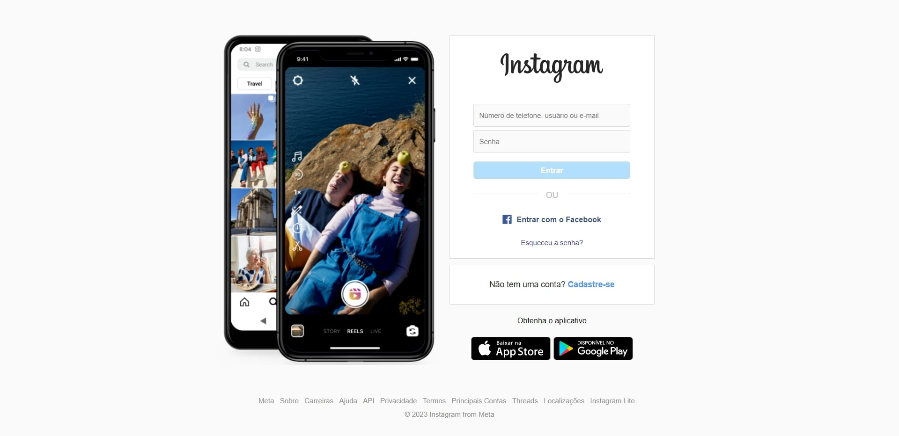

<h1 align="center"> Instagram </h1>

 

  

## 🚀 Tecnologias

Esse projeto foi desenvolvido com as seguintes tecnologias:

- HTML e CSS
- Git e Github

## 💻 Projeto

É um clone da página de login do instagram.

- [Acesse o projeto finalizado, online](#)

